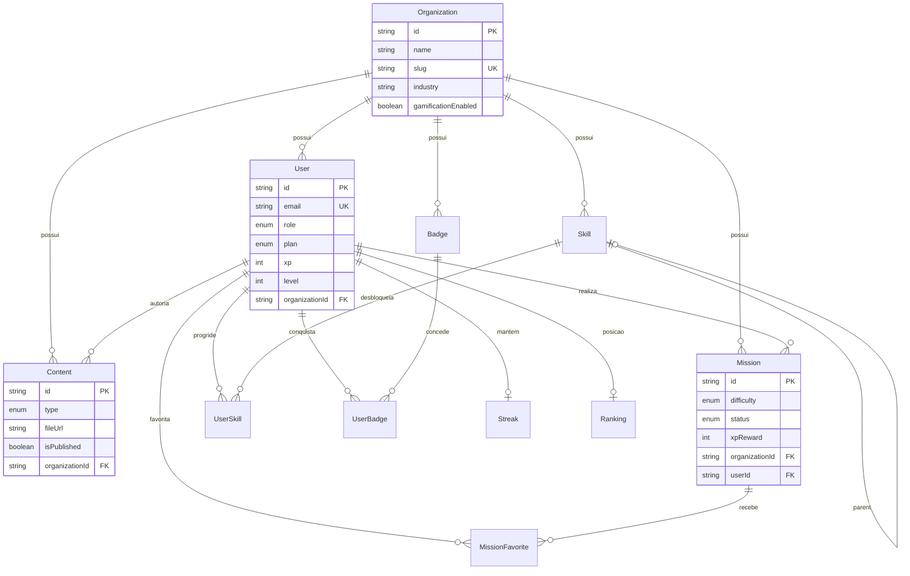

# Banco de Dados — SkillForge

## 1. Tecnologias

| Item | Tecnologia |
|------|------------|
| ORM | Prisma 6 |
| Dev local | SQLite (`backend/prisma/dev.db`) |
| Produção | MySQL 8 (Docker Compose incluído) |
| Schema | `backend/prisma/schema.prisma` |
| Seed | `backend/prisma/seed.js` |
| Config | `backend/.env.example` |

---

## 2. Diagrama Entidade-Relacionamento



---

## 3. Models (tabelas)

| Model | Tabela | Descrição |
|-------|--------|-----------|
| `Organization` | `organizations` | Cliente B2B (cursinho, empresa) |
| `User` | `users` | Admin, aluno ou super admin |
| `Content` | `contents` | PDFs e imagens uploadados |
| `Mission` | `missions` | Atividades gamificadas |
| `MissionFavorite` | `mission_favorites` | Favoritos do aluno |
| `Skill` | `skills` | Árvore de habilidades por org |
| `Badge` | `badges` | Conquistas por org |
| `UserSkill` | `user_skills` | Progresso em skills |
| `UserBadge` | `user_badges` | Badges conquistadas |
| `Ranking` | `rankings` | Posição no leaderboard |
| `Streak` | `streaks` | Sequência diária de estudo |

---

## 4. Enums

- **Role:** `SUPER_ADMIN`, `ORG_ADMIN`, `USER`
- **Plan:** `FREE`, `PREMIUM`
- **ContentType:** `PDF`, `IMAGE`
- **MissionDifficulty:** `EASY`, `MEDIUM`, `HARD`, `BOSS`
- **MissionStatus:** `PENDING`, `IN_PROGRESS`, `COMPLETED`
- **SkillCategory:** `FRONTEND`, `BACKEND`, `DATABASE`, `SOFT_SKILLS`, `DEVOPS`, `CUSTOM`

---

## 5. Scripts de criação e população

### Criar / sincronizar schema

```bash
cd backend
cp .env.example .env
npm run db:generate
npm run db:push
```

### Popular dados de demonstração

```bash
npm run db:seed
```

### MySQL (produção)

1. Altere `provider = "mysql"` em `prisma/schema.prisma`
2. Configure `DATABASE_URL` no `.env`
3. `docker compose up -d` (opcional)
4. `npm run db:push && npm run db:seed`

### Visualizar dados

```bash
npm run db:studio
```

---

## 6. Arquivos de configuração

| Arquivo | Função |
|---------|--------|
| `backend/prisma/schema.prisma` | Definição completa do banco |
| `backend/prisma/seed.js` | Dados mock (2 orgs, 8+ alunos demo, conteúdos) |
| `backend/.env.example` | Variáveis `DATABASE_URL`, `JWT_SECRET`, `PORT` |
| `docker-compose.yml` | MySQL 8 para ambiente containerizado |

---

## 7. Relacionamentos principais

- Uma **Organization** agrupa usuários, conteúdos, missões, skills e badges
- **USER** pertence a uma organização; **ORG_ADMIN** gerencia a mesma org
- **Content** é vinculado à org; upload salvo em `backend/uploads/{organizationId}/`
- **Mission** pertence ao aluno (`userId`) e à org (`organizationId`)
- **Ranking** e **Streak** são calculados por usuário dentro da org
