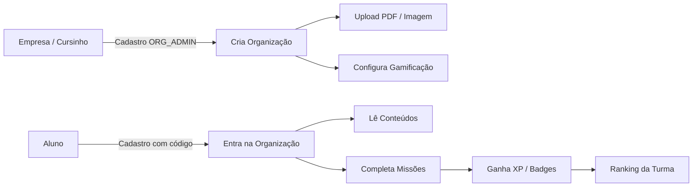

# Documentação da Solução — SkillForge

## 1. Nome da solução

**SkillForge** — Plataforma B2B de gamificação de conteúdos educacionais e corporativos.

---

## 2. Público-alvo

### Clientes (B2B)
- Cursinhos pré-vestibulares e preparatórios
- Escolas técnicas e instituições SENAI
- Empresas com treinamentos internos
- Produtoras de conteúdo que querem engajar alunos online
- Comunidades e memberships educacionais

### Usuários finais
- **Administradores da organização (ORG_ADMIN):** sobem PDFs/imagens, configuram missões, XP, badges e acompanham alunos
- **Alunos / colaboradores (USER):** consomem conteúdos, completam atividades e participam do ranking gamificado

---

## 3. Problema resolvido

Instituições e empresas possuem **conteúdos estáticos** (PDFs, apostilas, imagens) que geram **baixo engajamento**. Ferramentas genéricas de LMS são complexas e caras; soluções gamificadas prontas não permitem que **cada cliente configure sua própria trilha** com sua marca e materiais.

A SkillForge resolve isso ao oferecer uma **plataforma white-label simplificada** onde qualquer organização:

1. Cria sua conta e organização
2. Faz upload de materiais (PDF e imagem)
3. Configura gamificação (missões, XP, ranking, skills, badges)
4. Convida alunos via código da organização

---

## 4. Diferencial da solução

| Diferencial | Descrição |
|-------------|-----------|
| **Multi-tenant B2B** | Cada cliente tem organização isolada com conteúdos e gamificação próprios |
| **Upload simples** | PDF e imagens sem depender de LMS pesado |
| **Dois perfis claros** | Admin (gestão) vs Aluno (consumo + jogo) |
| **Gamificação completa** | XP, níveis, missões, boss fights, skill tree, badges, streak, ranking |
| **UX premium** | Dark/light mode, animações, dashboard com gráficos |
| **Pronto para demo** | Seed com organizações exemplo (Demo + Alpha Pré-Vestibular) |
| **Escalável** | API REST, Prisma ORM, SQLite (dev) / MySQL (prod) |

---

## 5. Modelo de monetização escolhido e justificativa

### Modelo: **Freemium B2B + SaaS por organização**

| Plano | Preço sugerido | Recursos |
|-------|----------------|----------|
| **Free** | R$ 0 | 1 organização, até 50 alunos, 10 conteúdos, gamificação básica |
| **Premium** | R$ 29,90/mês ou R$ 299/ano | Alunos ilimitados, analytics, badges exclusivas, boss fights, streak 2x |
| **Enterprise** | Sob consulta | White-label, API, SLA, múltiplas unidades SENAI |

### Justificativa

1. **Barreira baixa de entrada (Free):** permite que cursinhos pequenos testem na hackathon e convertam depois.
2. **Receita recorrente (Premium):** analytics e badges exclusivas geram valor contínuo para quem já usa a plataforma.
3. **Licenciamento B2B (Enterprise):** escolas SENAI e redes de ensino pagam por volume/unidade — alinhado ao público do hackathon DESI.
4. **Upsell natural:** organizações que sobem conteúdos e veem engajamento no ranking tendem a migrar para Premium.

---

## 6. Fluxo da solução

---

## 7. Equipe

Felipe Dourado Deczka · Ygor Passos Luciano · Andrei Camargo · Mateus Mathias · Nicolas Carlos

---

## 8. Repositório e execução

- **Código:** https://github.com/dourado99k/HACKATON
- **Execução local:** ver [README.md](../README.md)
- **Deploy:** não publicado em produção (demonstração via execução local)
